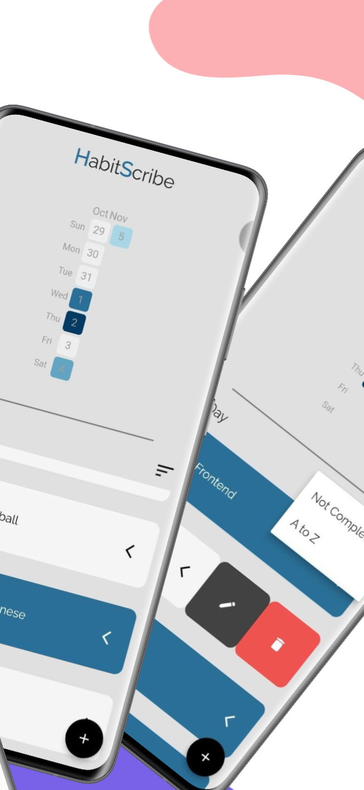
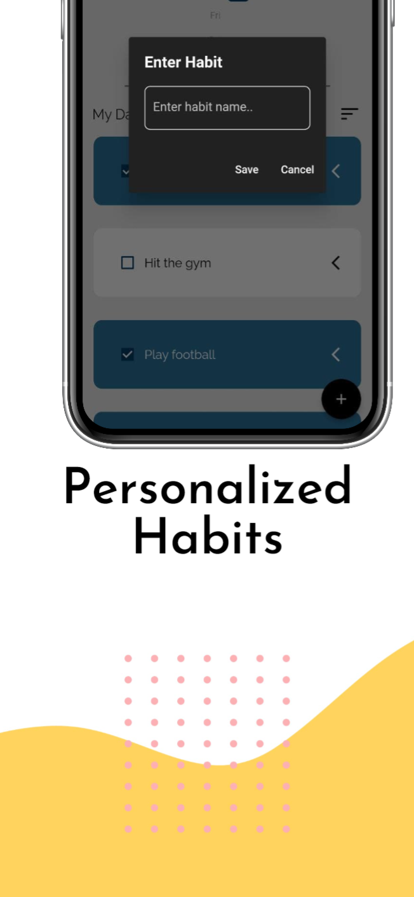

# HabitScribe

Develop healthier habits with HabitScribe! This intuitive habit tracking app helps you build a positive daily routine, achieve personal goals, and enhance your overall well-being. Seamlessly track your progress, set reminders, and receive motivational insights to stay on track. With its user-friendly interface and customizable features, HabitScribe empowers you to cultivate productive habits and transform your lifestyle. Download now and embark on your journey to a better you.

## Table of Contents

- [Introduction](#introduction)
- [Screenshots](#screenshots)
- [Features](#features)
- [Getting Started](#getting-started)
  - [Prerequisites](#prerequisites)
  - [Installation](#installation)
- [Contributing](#contributing)
- [License](#license)
- [Acknowledgments](#acknowledgments)

## Introduction

Welcome to HabitScribe – the essential habit tracking app that helps you stay on top of your daily routines and achieve your goals effectively. With HabitScribe, effortlessly manage and monitor your habits to ensure a productive and organized lifestyle.

Visualize your progress with the comprehensive heatmap feature, displaying an overview of your completed habits over time. Stay motivated as you track your daily achievements and utilize the analytics to assess your performance and identify patterns for continuous improvement.

Simplify your habit management by creating, editing, and deleting habits effortlessly. Utilize the convenient sorting options to organize your habits alphabetically or prioritize tasks that are yet to be completed, ensuring you always stay focused and on track.

Enjoy a seamless user experience with HabitScribe's intuitive interface and streamlined navigation, making habit tracking and management a hassle-free process. Download HabitScribe now and take charge of your daily routines to lead a more organized and efficient life.

## Screenshots 





## Features

- Comprehensive heatmap for visualizing daily habit completion
- Effortless habit creation, editing, and deletion
- Seamless sorting options for alphabetically organizing habits
- Prioritization of tasks based on incomplete habits
- User-friendly interface for intuitive navigation
- Streamlined habit tracking for effective goal management
- Personalized habit management for a productive lifestyle
- Real-time progress monitoring for enhanced motivation
- Simplified habit visualization for improved task prioritization

## Getting Started

### Prerequisites

Make sure you have the following prerequisites installed before running HabitScribe:

- [Flutter](https://flutter.dev/)
- [Hive](https://docs.hivedb.dev/#/)

### Installation

Follow these steps to install HabitScribe:

1. Clone the repository:
   ```bash
   git clone https://github.com/your-username/habitscribe.git
   
2. Navigate to the project directory:
   ```bash
   cd habitscribe
   
3. Run pub get to get the dependencies:
   ```bash
   flutter pub get

5. Run the Flutter app:
   ```bash
   flutter run

## Contributing

We welcome contributions! Follow these steps to contribute to HabitScribe:

1. Fork the repository.
2. Create a new branch:
   ```bash
   git checkout -b <feature-name>
3. Make changes and commit:
   ```bash
   git commit -m <"Add new feature">
4. Push to the branch:
   ```bash
    git push origin <feature-name>
5. Open a pull request.

## License
This project is licensed under the MIT License.

## Acknowledgments

- Thanks to the Flutter community for the amazing framework.
- Special thanks to the creators of Hive for efficient local storage.
